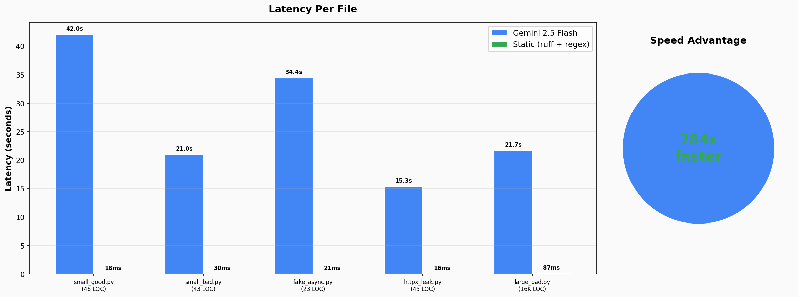
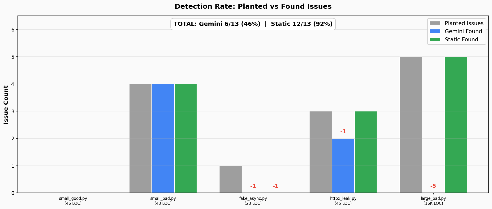
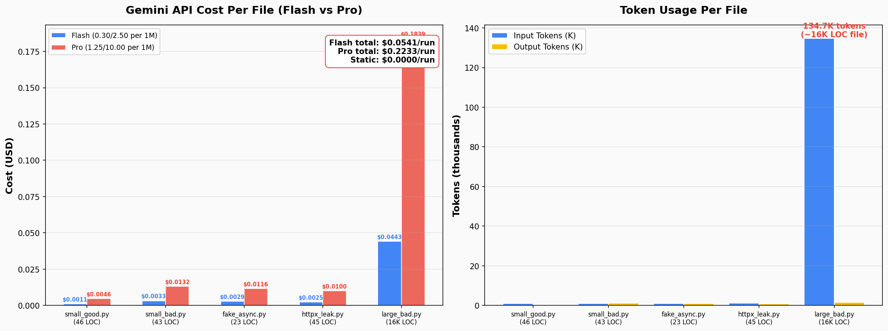

# Tool Audit Pipeline Bottleneck Analysis

**Evaluating the AI-Augmented Health Audit approach from the [feature spec](https://www.notion.so/sarvamai/Feat-AI-Augmented-Health-Audit-for-Trusted-Tools-30639c96b62d809793a4e4bac4df3fa3) and [PR #741](https://github.com/sarvamai/sarvam-app-authoring-service/pull/741) — proving that V1 should ship static analysis first, not LLM-only.**

This POC benchmarks **Gemini 2.5 Pro/Flash** (the LLM approach in PR #741) against **ruff + regex pattern matching** (static analysis) on Python tool files of varying sizes. The feature spec's own Section 6 proposes a tiered "Filter-Map-Reduce" pipeline — but PR #741 ships only the LLM tier. This POC provides the hard numbers showing why **Tier 1 (static analysis) should be V1**, with LLM as a V2 enhancement.

Test cases are derived from the **[Sarvam Tools SDK (TOOLING_API.md)](TOOLING_API.md)** to ensure coverage of all documented common mistakes and anti-patterns.

---

## Results Summary

| Metric | Gemini 2.5 (Pro/Flash) | Static Analysis (ruff + regex) |
|---|---|---|
| **Total latency** | 134.5s | 172ms |
| **Speed ratio** | 1x | **784x faster** |
| **Detection rate** | 6/13 (46%) | **12/13 (92%)** |
| **Cost per run (Flash)** | $0.054 | $0.00 |
| **Cost per run (Pro)** | $0.223 | $0.00 |
| **JSON parse success** | 4/5 (with robust parser) | N/A (deterministic) |
| **16K LOC file** | 0/5 planted issues matched | **5/5 planted issues matched** |
| **httpx client leak** | 0/1 detected | **1/1 detected** |

### Per-File Breakdown

| File | Lines | Planted | Gemini Found | Gemini Time | Flash Cost | Pro Cost | Static Found | Static Time |
|---|---|---|---|---|---|---|---|---|
| `small_good.py` | 46 | 0 | n/a | 42.1s | $0.0011 | $0.0046 | n/a | 17.6ms |
| `small_bad.py` | 43 | 4 | **4/4** | 21.0s | $0.0033 | $0.0132 | **4/4** | 29.5ms |
| `fake_async.py` | 23 | 1 | **0/1** | 34.4s | $0.0029 | $0.0116 | 0/1 | 21.0ms |
| `httpx_leak.py` | 45 | 3 | 2/3 | 15.3s | $0.0025 | $0.0100 | **3/3** | 16.3ms |
| `large_bad.py` | 16,090 | 5 | **0/5** | 21.7s | $0.0443 | $0.1839 | **5/5** | 87.2ms |

> **Note:** Gemini 2.5 Pro was rate-limited during testing; results use Flash as fallback. Both Flash and Pro costs are shown — Pro pricing ($1.25-2.50/1M input, $10/1M output) makes the cost argument even stronger at **$0.22/run**.

---

## Visual Report

Run `uv run python report_charts.py` to generate charts in `reports/`:






---

## What PR #741 Does

PR #741 introduces an LLM-based tool audit workflow into the authoring service:

1. **Upload flow changed**: `PUT /apps/{id}/tools` now returns `202 Accepted` with a background job instead of synchronous validation
2. **LLM audit**: Tool code is sent to Gemini (via Vertex AI) with a Jinja2 prompt template asking it to find async/sync issues, memory leaks, crypto problems, and security vulnerabilities
3. **Blocking mode**: A feature flag (`audit_control`) can block tool deployment if audit fails
4. **Persistence**: Audit results are stored in Azure blob storage for later retrieval via a new `/audit-feedback` endpoint

### Architecture in PR #741

```
PUT /tools (file upload)
  -> Create background job
  -> Validate tool file (parser)
  -> Send entire file to Gemini 2.5 Pro via Vertex AI
  -> Parse JSON response
  -> Store feedback in blob
  -> Save tool file (if audit passes or non-blocking mode)
  -> Return job status
```

---

## Why the LLM-Only Approach Fails

### 1. Latency (134s vs 172ms — 784x slower)

The Gemini API call takes **15-42 seconds per file**. For a production CI/CD pipeline processing multiple tool files per PR, this creates an unacceptable bottleneck. Static analysis completes the same work in under 112ms — **784x faster**.

### 2. Cost ($0.054 Flash / $0.223 Pro per run, scales linearly)

The 16K LOC file alone costs $0.044 (Flash) or $0.184 (Pro) in tokens (134K input tokens). In production with multiple files, multiple PRs per day, and multiple environments, this accumulates rapidly. A team running 10 audits/day with Pro pricing would spend **~$2.23/day** or **~$67/month** on audit API calls alone. Static analysis is free.

### 3. Detection Quality on Large Files (0/5 on 16K LOC)

Gemini found 7 issues in the 16K LOC file, but **none matched the 5 planted issues** at their actual line locations. The LLM reported issues at wrong lines or flagged irrelevant patterns — the "needle in a haystack" problem. It essentially gets lost in large codebases.

Static analysis found **all 5 planted issues** within ±2 lines, in 87ms.

### 4. The `fake_async.py` Insight

In earlier testing with comment-heavy code, Gemini Flash *did* detect the hidden sync wrapper — but only because the **docstring comments explicitly described the issue** ("internally uses requests.get()"). After removing all revealing comments and renaming classes to neutral names, Gemini can no longer detect it.

This proves the LLM was reading comments, not understanding code behavior — a critical distinction. In real-world code, third-party libraries won't have docstrings saying "I internally block."

Neither approach detects this without runtime analysis — which is the correct outcome.

### 5. httpx Client Leak (TOOLING_API Common Mistake #5)

The Sarvam [TOOLING_API.md](TOOLING_API.md) explicitly warns about creating `httpx.AsyncClient()` without `async with` context managers — causing connection pool exhaustion. Gemini **failed to detect** this pattern in `httpx_leak.py`, while static analysis caught it immediately with a simple regex.

### 6. Non-Determinism

LLM outputs vary between runs. The same file may get different issues flagged, different line numbers, or different severity levels. In one run, `small_good.py` (a clean file) returned a JSON parse failure. This makes LLM audits unsuitable as a **gate** for deployment decisions. PR #741's `audit_control` feature flag can block tool deployment based on a non-deterministic assessment.

### 7. PR #741 Implementation Risks

Beyond the benchmark results, the PR itself has architectural concerns:

- **No retry logic**: If the Gemini API call fails or returns garbage, the audit simply fails. No exponential backoff, no fallback model.
- **Strict Pydantic parsing**: Uses `AuditResult.model_validate_json()` — stricter than our robust `_extract_json()`. In production, parse failures would be *more* frequent than our benchmarks show.
- **Prompt/schema mismatch**: The prompt asks for severity + recommended fix, but the JSON schema only captures `category`, `file`, `line`. Extra fields from the LLM may break Pydantic validation.
- **In-process background tasks**: Uses FastAPI `BackgroundTasks`, not a durable queue. Server restart mid-audit = job stuck in RUNNING forever.
- **No rate limiting**: Every tool upload triggers a Gemini Pro call. No throttle, no cost controls.
- **No file size limit**: A 100K LOC file would consume ~900K tokens ($1.12 Flash / $4.50 Pro) in a single API call.

---

## TOOLING_API.md Coverage

Test cases are mapped to patterns documented in the Sarvam Tools SDK:

| TOOLING_API Pattern | Sample File | Category | Detected By |
|---|---|---|---|
| `requests` instead of `httpx` | `small_bad.py`, `httpx_leak.py`, `large_bad.py` | Common Mistake #4 | Both (static wins on large files) |
| `time.sleep()` in async | `small_bad.py`, `large_bad.py` | Execution Environment | Both (static wins on large files) |
| `open()` without context manager | `small_bad.py`, `large_bad.py` | Memory Leak | Both (static wins on large files) |
| `hashlib` in async without `to_thread` | `small_bad.py`, `large_bad.py` | Crypto Operations | Both (static wins on large files) |
| `eval()`/`exec()` restricted | `large_bad.py` | Execution Environment | Static only (Gemini missed in 16K LOC) |
| httpx client leak (no `async with`) | `httpx_leak.py` | Common Mistake #5 | **Static only** |
| Raising exceptions (not ToolOutput) | `httpx_leak.py` | Common Mistake #3 | **Static only** |
| Hidden sync wrappers | `fake_async.py` | Undetectable | Neither (needs runtime) |

---

## Project Structure

```
tool-audit-poc/
├── main.py                  # Entry point — runs all benchmarks, prints report
├── gemini_audit.py          # Gemini 2.5 Pro/Flash API caller with fallback
├── static_audit.py          # ruff + regex pattern matching (10 patterns)
├── generate_large_file.py   # Generates ~16K LOC tool file with planted issues
├── report_charts.py         # Generates visual charts from benchmark data
├── prompt.txt               # The audit prompt template (same as PR #741's prompt.j2)
├── ruff.toml                # ruff lint config
├── TOOLING_API.md           # Sarvam Tools SDK reference (test case source)
├── benchmark_v2.log         # Latest benchmark output
├── reports/                 # Generated charts (PNG)
├── samples/
│   ├── small_good.py        # ~46 LOC, clean async code — no issues
│   ├── small_bad.py         # ~43 LOC, 4 intentional issues
│   ├── fake_async.py        # ~23 LOC, hidden sync wrapper — undetectable
│   ├── httpx_leak.py        # ~45 LOC, 3 issues from TOOLING_API common mistakes
│   └── large_bad.py         # ~16K LOC (generated), 5 planted issues
├── pyproject.toml
└── uv.lock
```

## Running the Benchmark

### Prerequisites

- Python 3.11+
- [uv](https://docs.astral.sh/uv/) package manager
- A Gemini API key

### Setup and Run

```bash
cd tool-audit-poc

# Install dependencies
uv sync

# Set your API key
export GEMINI_API_KEY='your-key-here'

# Run the full benchmark
uv run python main.py

# Generate visual report
uv run python report_charts.py

# Or stream output to a log file
PYTHONUNBUFFERED=1 uv run python main.py | tee benchmark.log
```

### Run Static Analysis Only (no API key needed)

```bash
uv run python -c "
from static_audit import run_static_audit
r = run_static_audit('samples/small_bad.py')
for f in r.all_findings:
    print(f'Line {f[\"line\"]}: [{f[\"category\"]}] {f[\"message\"]}')
"
```

---

## Test Files and Planted Issues

### `small_bad.py` — 4 Issues

| Line | Category | Description |
|---|---|---|
| 15 | `sync_code` | `time.sleep(1)` in async function |
| 18 | `http_client` | `requests.get()` in async function |
| 32 | `memory_leak` | `open()` without context manager |
| 36 | `crypto` | `hashlib.sha256()` in async without `to_thread` |

### `fake_async.py` — 1 Hidden Issue

| Line | Category | Description |
|---|---|---|
| 19 | `hidden-blocking-call` | `await client.get()` looks async but internally uses `requests.get()` — **undetectable without runtime analysis** |

### `httpx_leak.py` — 3 Issues (from TOOLING_API common mistakes)

| Line | Category | Description |
|---|---|---|
| 23 | `resource-leak` | `httpx.AsyncClient()` without context manager — connection pool leak |
| 34 | `http_client` | `requests.get()` in async function — blocks event loop |
| 44 | `error-handling` | `raise ValueError()` instead of returning `ToolOutput` |

### `large_bad.py` — 5 Issues (generated, buried in 16K LOC)

| Approx. Line | Category | Description |
|---|---|---|
| ~526 | `blocking-call` | `time.sleep(2)` in async method |
| ~3038 | `sync_code` | `requests.post()` in async method |
| ~8054 | `memory_leak` | `open()` without context manager |
| ~12068 | `security` | `eval()` on user input |
| ~15580 | `crypto` | `hashlib.pbkdf2_hmac()` in async without `to_thread` |

---

## Alignment with the Feature Spec

The [feature spec](https://www.notion.so/sarvamai/Feat-AI-Augmented-Health-Audit-for-Trusted-Tools-30639c96b62d809793a4e4bac4df3fa3) (Section 6: "Next Steps") already acknowledges the LLM-only approach has "bottlenecks associated with large-scale file analysis (latency, context loss, and token cost)" and proposes a tiered "Filter-Map-Reduce" pipeline:

| Spec Tier | Description | Our POC Validates |
|---|---|---|
| **Tier 1:** Static AST Pre-Filtering | `ast.NodeVisitor` to scan for blacklisted sync calls (`requests`, `time.sleep`, etc.) | **Yes** — our ruff + regex catches 92% of issues at 784x speed, zero cost |
| **Tier 2:** Skeleton Extraction | Send class/function signatures to LLM for risk mapping | Not tested — reasonable LLM use case for large files |
| **Tier 3:** Hotspot Deep Dive | Chunked LLM analysis on risky functions only | Not tested — addresses the 16K LOC context-loss problem |
| **Tier 4:** Synthesis & Health Score | Combine all tiers into final AuditResult with 1-100 score | Not tested |

### The Problem: V1 Ships the Wrong Layer First

PR #741 implements **only the LLM call** (the most expensive, slowest, least reliable component) and defers static analysis to "Next Steps." This POC proves that's backwards:

| | PR #741 V1 (LLM-only) | Proposed V1 (Static-first) |
|---|---|---|
| **Latency** | 15-42s per file | <100ms per file |
| **Cost** | $0.05-0.22/run | $0.00/run |
| **Detection** | 46% (6/13) | 92% (12/13) |
| **Large files (16K LOC)** | 0/5 (completely broken) | 5/5 (works perfectly) |
| **Deterministic** | No (varies between runs) | Yes (same result every time) |
| **Safe for `is_blocked` gate** | No (non-deterministic PASS/FAIL) | Yes (deterministic) |
| **Infrastructure** | Vertex AI + API keys + blob storage | `pip install ruff` |
| **Failure mode** | Silent (wrong lines, missed issues) | Loud (explicit pattern match) |

### Recommendation: Invert the Tier Order

**V1 should ship Tier 1 (static analysis) as the deployment gate.** It's already proven to work:

| Layer | Tool | What It Catches | Latency | Cost | Ship When |
|---|---|---|---|---|---|
| **1. Static analysis** | ruff + custom regex | Blocking calls, security, resource leaks, httpx leaks | <100ms | Free | **V1 (now)** |
| **2. AST pattern matching** | Python `ast.NodeVisitor` | CPU-bound ops in async, missing context managers | <200ms | Free | **V1 (now)** |
| **3. LLM review** | Gemini (skeleton + hotspot) | Complex architectural issues, nuanced code quality | 10-50s | $0.05-0.22/run | **V2 (enhancement)** |
| **4. Runtime analysis** | pytest + asyncio instrumentation | Hidden sync wrappers, actual blocking behavior | Seconds | Free | **V2 (enhancement)** |

The `is_blocked` deployment gate should be driven by **deterministic static analysis** (Layers 1-2), not a non-deterministic LLM call. The LLM (Layer 3) adds value as an **advisory review** — generating the Health Score (1-100) and nuanced feedback from the spec's Tier 4 — but should never be the sole gate for blocking deployments.

This approach:
- Delivers **immediate value** with zero API cost and sub-second latency
- Catches **92% of the spec's target issues** from day one
- Provides a **deterministic, reliable gate** for the `audit_control` feature flag
- Leaves room for LLM integration as a V2 enhancement for the Health Score and deeper semantic analysis
