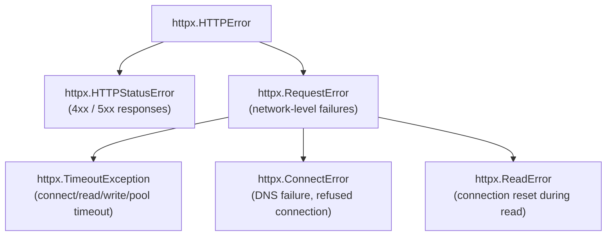
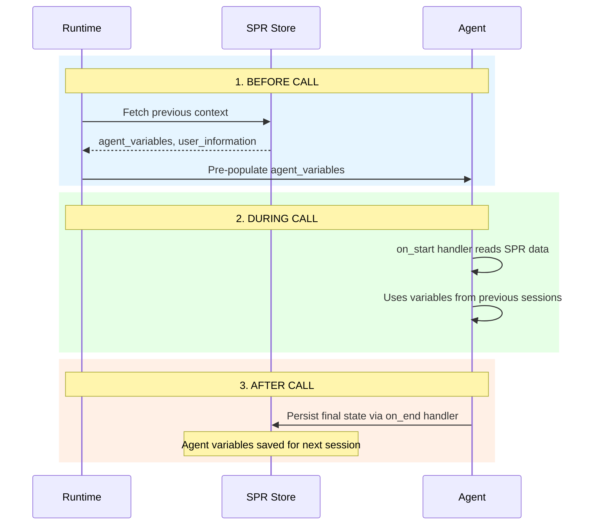

# Sarvam Tools SDK - Developer Guide

Reference for writing `tools.py` files for the Sarvam Agent Platform. This guide covers everything you need to build custom tools and lifecycle handlers.

> **Your scope**: Write Python tool files and upload them via the UI. Everything else (config, deployment, validation) is handled by the platform team.

---

## Table of Contents

1. [Overview](#overview)
2. [Tool Definition Guide](#tool-definition-guide)
3. [Available Packages and Imports](#available-packages-and-imports)
4. [Execution Environment](#execution-environment)
5. [Making HTTP Requests with httpx](#making-http-requests-with-httpx)
6. [StateContext API Reference](#statecontext-api-reference)
7. [Core Tools](#core-tools)
8. [Interaction Handlers](#interaction-handlers)
9. [Sarvam Personal Record](#sarvam-personal-record)
10. [Best Practices](#best-practices)
11. [Common Mistakes and Fixes](#common-mistakes-and-fixes)
12. [Complete Examples](#complete-examples)
13. [Quick Reference Card](#quick-reference-card)

---

## Overview

Tools are **Python classes** that extend agent capabilities beyond conversation. They allow agents to:

- Capture and process structured data from users
- Perform calculations or date/time conversions
- Update agent variables programmatically
- Integrate with external APIs via `httpx`
- Handle lifecycle events (`on_start`, `on_end`)

**Key Concepts:**
- Tools are defined as Python classes extending `BaseTool`
- Tool names are auto-derived from class names using `snake_case` conversion (e.g., `PaymentReceivedDate` → `payment_received_date`)
- A tool file must contain at least one `BaseTool` subclass OR one `on_start`/`on_end` handler
- All tool `run()` methods are `async` — use `httpx` for HTTP calls, never `requests`

---

## Tool Definition Guide

### Required Imports

```python
from sarvam_app_elements.agent import BaseTool, ToolOutput
from pydantic import Field
from sarvam_app_stream import StateContext
```

### Basic Tool Structure

```python
class MyToolName(BaseTool):
    """Tool description — this becomes the tool's description visible to the LLM."""

    # Input parameters (Pydantic fields)
    param_name: str = Field(
        description="Description of what this parameter expects"
    )
    optional_param: Optional[int] = Field(
        description="An optional parameter with default",
        default=None
    )

    async def run(self, context: StateContext, input_params=None) -> ToolOutput:
        """Main execution method — called when LLM invokes the tool."""

        # Your tool logic here
        result = process(self.param_name)

        return ToolOutput(
            message_to_llm="Internal message for LLM to use in response",
            message_to_user=["Optional direct message to user"],
            break_chat_agent_loop=False,
        )
```

### Class Name → Tool Name Conversion

The class name is automatically converted to `snake_case`:

| Class Name | Tool Name |
|-----------|-----------|
| `PaymentReceivedDate` | `payment_received_date` |
| `Calculator` | `calculator` |
| `DateTimeCaptureTool` | `date_time_capture_tool` |
| `SendSMS` | `send_s_m_s` |

> **Warning**: Avoid acronyms in class names — the conversion splits each capital letter as a word boundary. Use `SendMessage` instead of `SendSMS`.

### ToolOutput Fields

```python
ToolOutput(
    message_to_llm: str,           # Message sent to LLM (internal, not spoken to user)
    message_to_user: list[str],    # Messages spoken directly to user (optional)
    break_chat_agent_loop: bool,   # If True, stops the current LLM turn
)
```

| Field | Purpose | When to Use |
|-------|---------|-------------|
| `message_to_llm` | Internal message for LLM context | Always — tells LLM what happened |
| `message_to_user` | Direct messages spoken to user | For immediate feedback (errors, confirmations) |
| `break_chat_agent_loop` | Stops LLM processing | Set `True` for errors that need user re-input |

### Accessing Agent Context

```python
async def run(self, context: StateContext, input_params=None) -> ToolOutput:
    # Read sarvam variables (start_datetime, current_date, etc.)
    sarvam_vars = context.parent_context.state_machine.get_sarvam_variables()
    start_time = sarvam_vars.start_datetime
    current_date = sarvam_vars.current_date

    # Update agent variables
    context.parent_context.state_machine.update_agent_variable(
        "variable_name", "new_value"
    )

    # Read agent variables
    agent_vars = context.parent_context.state_machine.get_agent_variables()
```

### Parameter Types

Tools use Pydantic's `Field` for parameter definitions. The LLM sees these descriptions to know what to pass:

```python
class ExampleTool(BaseTool):
    """Demonstrates various parameter types"""

    # Required string
    name: str = Field(description="Customer's full name")

    # Required number
    amount: float = Field(description="Loan amount in INR")

    # Optional with default
    currency: str = Field(description="Currency code", default="INR")

    # Enum-like with description
    loan_type: str = Field(
        description="Type of loan: 'personal', 'business', or 'home'"
    )

    # Date string
    date_str: str = Field(
        description="Date in dd/mm/yyyy format, Example: '15/03/2025'"
    )
```

---

## Available Packages and Imports

Tool files run in a Python 3.11+ environment. The following packages are available.

### Sarvam SDK Packages (Core)

| Package | Import | Purpose |
|---------|--------|---------|
| `sarvam_tool` | `from sarvam_tool import BaseTool, ToolOutput` | Tool base class and output type |
| `sarvam_app_elements` | `from sarvam_app_elements.agent import BaseTool, ToolOutput` | Alternative import path for BaseTool |
| `sarvam_app_stream` | `from sarvam_app_stream import StateContext` | Agent state/context access |
| `sarvam_agents_sdk` | `from sarvam_agents_sdk import OnStartInput, OnStartOutput, OnEndInput, OnEndOutput` | Lifecycle handler types |
| `sarvam_core_tools` | `from sarvam_core_tools import EndConversation, TransitionState` | Built-in conversation control |

### Standard Python Libraries

```python
import os                          # Environment variables: os.getenv("LOG_LEVEL", "WARNING")
import logging                     # Logging: logging.getLogger(__name__)
import json                        # JSON parsing
import copy                        # Deep copying objects
import re                          # Regex operations
import string                      # String utilities

from typing import Optional, Any   # Type hints
from datetime import datetime, timedelta  # Date/time operations
```

### Third-Party Packages

| Package | Import | Purpose |
|---------|--------|---------|
| `pydantic` | `from pydantic import Field` | Parameter definitions (required for all tools) |
| `httpx` | `import httpx` | Async HTTP client for external API calls |
| `dateutil` | `from dateutil.relativedelta import relativedelta` | Month/year arithmetic (e.g., `+ relativedelta(months=3)`) |
| `pandas` | `import pandas` | Data processing |

### All Common Imports (Copy-Paste Starter)

```python
import os
import logging
import copy
import json
from typing import Optional, Any
from datetime import datetime, timedelta
from dateutil.relativedelta import relativedelta

from pydantic import Field
from sarvam_tool import BaseTool, ToolOutput
from sarvam_app_stream import StateContext
from sarvam_agents_sdk import OnStartInput, OnStartOutput, OnEndInput, OnEndOutput
from sarvam_core_tools import EndConversation
from sarvam_core_tools._conversation._end_conversation import EndConversationInput
from sarvam_core_tools import TransitionState, TransitionStateInput
import httpx
```

---

## Execution Environment

Tools run in one of two modes. **This is transparent to you as a tool author** — write your code the same way regardless.

**What to know:**
- Use standard imports (`datetime`, `pydantic`, `httpx`) — works in both modes
- `subprocess`, `os.system`, and `exec()`/`eval()` are restricted and will trigger sandboxed execution
- For external API calls, always use `httpx` (async HTTP) — works everywhere
- File I/O is restricted — use external APIs instead
- Never use `requests` — it blocks the async event loop

---

## Making HTTP Requests with httpx

`httpx` is the **recommended HTTP client** for all external API calls inside tools. It's async-native and available as a pre-installed dependency.

### Why httpx (Not requests)

| Feature | `httpx` | `requests` |
|---------|---------|------------|
| Async support | Native `async/await` | No (blocks the event loop) |
| Available in sandbox | Yes | No |
| Connection pooling | Built-in via `AsyncClient` | Separate adapter needed |
| HTTP/2 support | Yes | No |

> **Never use `requests`** in tool files. All tool `run()` methods are `async`, so blocking HTTP calls will freeze the agent's event loop.

### Basic Usage Pattern

```python
import httpx

class FetchCustomerData(BaseTool):
    """Fetches customer data from CRM API."""
    customer_id: str = Field(description="The customer ID to look up")

    async def run(self, context: StateContext, input_params=None) -> ToolOutput:
        async with httpx.AsyncClient() as client:
            response = await client.get(
                f"https://api.example.com/customers/{self.customer_id}",
                headers={"Authorization": "Bearer YOUR_API_KEY"},
                timeout=30.0,
            )
            response.raise_for_status()
            data = response.json()

        return ToolOutput(
            message_to_llm=f"Customer found: {data['name']}, Status: {data['status']}",
            break_chat_agent_loop=False,
        )
```

### AsyncClient Configuration

Always use `async with` to ensure connections are properly closed:

```python
# GOOD — Client is closed after the block
async with httpx.AsyncClient() as client:
    response = await client.get(url)

# BAD — Connection may leak
client = httpx.AsyncClient()
response = await client.get(url)
# forgot await client.aclose()
```

**Configuring defaults on the client:**

```python
async with httpx.AsyncClient(
    base_url="https://api.example.com/v1",
    headers={
        "Authorization": f"Bearer {api_key}",
        "Content-Type": "application/json",
    },
    timeout=httpx.Timeout(
        connect=5.0,    # Time to establish connection
        read=30.0,      # Time to read response
        write=10.0,     # Time to send request body
        pool=5.0,       # Time waiting for a connection from pool
    ),
) as client:
    # All requests inherit base_url, headers, and timeout
    users = await client.get("/users")
    orders = await client.get("/orders")
```

### Common HTTP Methods

```python
async with httpx.AsyncClient() as client:
    # GET — fetch data
    response = await client.get(
        "https://api.example.com/data",
        params={"page": 1, "limit": 50},    # Query parameters
        headers={"X-API-Key": "key123"},
    )

    # POST — send JSON body
    response = await client.post(
        "https://api.example.com/records",
        json={"name": "John", "phone": "+919840020605"},  # Auto-serializes to JSON
        timeout=30.0,
    )

    # PUT — update resource
    response = await client.put(
        "https://api.example.com/records/123",
        json={"status": "updated"},
    )

    # DELETE — remove resource
    response = await client.delete(
        "https://api.example.com/records/123",
    )

    # POST — send form data
    response = await client.post(
        "https://api.example.com/upload",
        data={"field1": "value1"},           # Form-encoded
        files={"file": ("report.csv", csv_bytes, "text/csv")},
    )
```

### Error Handling

**Always handle HTTP errors gracefully** — return `ToolOutput` with error info, never let exceptions propagate:

```python
import httpx
import logging

logger = logging.getLogger(__name__)

class SendNotification(BaseTool):
    """Sends a notification to the customer via external API."""
    phone_number: str = Field(description="Customer phone number")
    message: str = Field(description="Notification message text")

    async def run(self, context: StateContext, input_params=None) -> ToolOutput:
        try:
            async with httpx.AsyncClient(timeout=30.0) as client:
                response = await client.post(
                    "https://api.example.com/notifications",
                    json={
                        "phone": self.phone_number,
                        "message": self.message,
                    },
                    headers={"Authorization": f"Bearer {os.getenv('NOTIF_API_KEY')}"},
                )
                response.raise_for_status()
                result = response.json()

            return ToolOutput(
                message_to_llm=f"Notification sent successfully. ID: {result.get('id')}",
                break_chat_agent_loop=False,
            )

        except httpx.TimeoutException:
            logger.warning(f"Notification API timeout for {self.phone_number}")
            return ToolOutput(
                message_to_llm="NOTIFICATION_TIMEOUT: The notification service is slow. Try again later.",
                break_chat_agent_loop=False,
            )

        except httpx.HTTPStatusError as exc:
            logger.error(
                f"Notification API error — Status: {exc.response.status_code}, "
                f"Detail: {exc.response.text}"
            )
            if exc.response.status_code == 429:
                return ToolOutput(
                    message_to_llm="RATE_LIMITED: Too many notification requests. Try again shortly.",
                    break_chat_agent_loop=False,
                )
            return ToolOutput(
                message_to_llm=f"NOTIFICATION_FAILED: HTTP {exc.response.status_code}",
                break_chat_agent_loop=False,
            )

        except httpx.RequestError as exc:
            logger.error(f"Network error sending notification: {exc}")
            return ToolOutput(
                message_to_llm="NETWORK_ERROR: Could not reach the notification service.",
                break_chat_agent_loop=False,
            )
```

**httpx exception hierarchy:**



### Making LLM Calls from Tools

A common pattern is calling an LLM API from within a tool for complex processing:

```python
import httpx
import copy

model = {
    "name": "model_name",
    "url": "https://api.example.com/v1/chat/completions",
    "api_key": "your_api_key",
}
llm_config = {"temperature": 0.1, "max_tokens": 512}

async def call_llm(messages: list[dict]) -> str | None:
    """Make an async LLM call from within a tool."""
    headers = {"Content-Type": "application/json"}
    payload = copy.deepcopy(llm_config)
    payload["stream"] = False
    payload["messages"] = messages
    payload["model"] = model["name"]

    if model.get("api_key"):
        headers["Authorization"] = f"Bearer {model['api_key']}"

    try:
        async with httpx.AsyncClient() as client:
            response = await client.post(
                url=model["url"],
                headers=headers,
                json=payload,
                timeout=60.0,
            )
            response.raise_for_status()
            return response.json()["choices"][0]["message"]["content"]

    except httpx.HTTPStatusError as exc:
        logger.error(
            f"LLM API error — Status: {exc.response.status_code}, "
            f"Detail: {exc.response.text}"
        )
        return None
    except httpx.TimeoutException:
        logger.error("LLM API call timed out")
        return None
    except Exception as e:
        logger.error(f"LLM call failed: {str(e)}")
        return None


class AnalyzeSentiment(BaseTool):
    """Analyzes customer sentiment from conversation using an LLM."""
    conversation_text: str = Field(description="The conversation text to analyze")

    async def run(self, context: StateContext, input_params=None) -> ToolOutput:
        result = await call_llm([
            {"role": "system", "content": "Classify sentiment as POSITIVE, NEGATIVE, or NEUTRAL."},
            {"role": "user", "content": self.conversation_text},
        ])

        if result is None:
            return ToolOutput(
                message_to_llm="SENTIMENT_ERROR: Could not analyze sentiment",
                break_chat_agent_loop=False,
            )

        context.parent_context.state_machine.update_agent_variable("sentiment", result.strip())
        return ToolOutput(
            message_to_llm=f"Sentiment analysis: {result.strip()}",
            break_chat_agent_loop=False,
        )
```

### Persisting Data to SPR via httpx

```python
import httpx
import os

async def save_to_spr(app_id: str, user_id: str, agent_variables: dict) -> bool:
    """Persist agent state to SPR after call ends."""
    spr_payload = {
        "agent_variables": agent_variables,
        "internal_variables": {},
        "user_information": {},
        "authoring_config": {},
        "custom_app_config": {},
    }

    try:
        async with httpx.AsyncClient(timeout=15.0) as client:
            response = await client.put(
                f"https://apps.sarvam.ai/api/app-authoring/apps/{app_id}/users/{user_id}/spr",
                json=spr_payload,
                headers={"Authorization": f"Bearer {os.getenv('API_TOKEN')}"},
            )
            response.raise_for_status()
            return True

    except httpx.HTTPStatusError as exc:
        logger.error(f"SPR save failed — {exc.response.status_code}: {exc.response.text}")
        return False
    except Exception as e:
        logger.error(f"SPR save error: {e}")
        return False
```

### Parallel Async Requests

When you need to call multiple APIs concurrently:

```python
import asyncio
import httpx

class EnrichCustomerProfile(BaseTool):
    """Enriches customer profile by fetching data from multiple sources."""
    customer_id: str = Field(description="Customer ID to enrich")

    async def run(self, context: StateContext, input_params=None) -> ToolOutput:
        async with httpx.AsyncClient(timeout=15.0) as client:
            # Fire all requests concurrently
            crm_task = client.get(f"https://crm.example.com/api/customers/{self.customer_id}")
            payment_task = client.get(f"https://payments.example.com/api/history/{self.customer_id}")
            support_task = client.get(f"https://support.example.com/api/tickets/{self.customer_id}")

            # Await all concurrently using asyncio.gather
            results = await asyncio.gather(
                crm_task, payment_task, support_task,
                return_exceptions=True,
            )

        crm_data = results[0].json() if not isinstance(results[0], Exception) else {}
        payment_data = results[1].json() if not isinstance(results[1], Exception) else {}
        support_data = results[2].json() if not isinstance(results[2], Exception) else {}

        summary = (
            f"Customer: {crm_data.get('name', 'Unknown')}, "
            f"Payments: {len(payment_data.get('transactions', []))}, "
            f"Open tickets: {len(support_data.get('tickets', []))}"
        )

        return ToolOutput(
            message_to_llm=summary,
            break_chat_agent_loop=False,
        )
```

### Retry Pattern

For unreliable external APIs, implement simple retry logic:

```python
import httpx
import asyncio

async def fetch_with_retry(
    client: httpx.AsyncClient,
    method: str,
    url: str,
    max_retries: int = 3,
    backoff_base: float = 1.0,
    **kwargs,
) -> httpx.Response:
    """Fetch with exponential backoff retry."""
    last_exception = None

    for attempt in range(max_retries):
        try:
            response = await client.request(method, url, **kwargs)
            response.raise_for_status()
            return response
        except (httpx.TimeoutException, httpx.HTTPStatusError) as e:
            last_exception = e
            if isinstance(e, httpx.HTTPStatusError) and e.response.status_code < 500:
                raise  # Don't retry client errors (4xx)
            if attempt < max_retries - 1:
                wait_time = backoff_base * (2 ** attempt)
                await asyncio.sleep(wait_time)

    raise last_exception


# Usage in a tool:
class FetchExternalData(BaseTool):
    """Fetches data from an external API with retry logic."""
    query: str = Field(description="Search query")

    async def run(self, context: StateContext, input_params=None) -> ToolOutput:
        try:
            async with httpx.AsyncClient(timeout=15.0) as client:
                response = await fetch_with_retry(
                    client, "GET", "https://api.example.com/search",
                    params={"q": self.query},
                    max_retries=3,
                )
                data = response.json()

            return ToolOutput(
                message_to_llm=f"Found {len(data['results'])} results",
                break_chat_agent_loop=False,
            )
        except Exception as e:
            logger.error(f"External API failed after retries: {e}")
            return ToolOutput(
                message_to_llm="EXTERNAL_API_UNAVAILABLE: Service is currently down",
                break_chat_agent_loop=False,
            )
```

### Timeout Guidelines

| Scenario | Recommended Timeout | Rationale |
|----------|-------------------|-----------|
| Simple GET (CRM lookup) | `10.0s` | Fast response expected |
| POST with processing (notification) | `30.0s` | Server-side processing |
| LLM API call | `60.0s` | Model inference is slow |
| File upload / download | `120.0s` | Large payloads |
| Health check / ping | `5.0s` | Should be near-instant |

```python
# Fine-grained timeout control
timeout = httpx.Timeout(
    connect=5.0,    # Max time to establish TCP connection
    read=30.0,      # Max time waiting for response data
    write=10.0,     # Max time sending request body
    pool=5.0,       # Max time waiting for available connection from pool
)
async with httpx.AsyncClient(timeout=timeout) as client:
    response = await client.post(url, json=payload)
```

---

## StateContext API Reference

The `StateContext` provides methods to interact with agent state during tool execution. Access is always through `context.parent_context.state_machine`.

### Agent Variables

User-facing variables defined in agent config. All values stored as **strings**.

```python
# Get all agent variables
variables = context.parent_context.state_machine.get_agent_variables()

# Get specific variable with default
name = context.parent_context.state_machine.get_agent_variables().get("customer_name", "")
amount = context.parent_context.state_machine.get_agent_variables().get("loan_amount", "0")

# Update agent variable (value is always a string)
context.parent_context.state_machine.update_agent_variable("disposition", "QUALIFIED")
context.parent_context.state_machine.update_agent_variable("callback_time", "2025-03-15T10:00:00")
```

### Internal Variables

Hidden from LLM — used for tool-to-tool communication and internal state tracking.

```python
# Get internal variables
internal_vars = context.parent_context.state_machine.get_internal_variables()
retry_count = internal_vars.get("num_retry", 0)

# Update internal variable
context.parent_context.state_machine.update_internal_variable("num_retry", retry_count + 1)
context.parent_context.state_machine.update_internal_variable("cutoff_date_retry", "2")
```

### System Variables

System-level configuration and state.

```python
# Get system variables
system_vars = context.parent_context.state_machine.get_system_variables()

# Update system variable
context.parent_context.state_machine.update_system_variable("key", "value")
```

### Sarvam Variables

Platform-provided read-only variables (start time, language).

```python
sarvam_vars = context.parent_context.state_machine.get_sarvam_variables()
start_datetime = sarvam_vars.start_datetime    # ISO timestamp: "2025-03-15T10:30:00"
language_name = sarvam_vars.language_name       # Current language: "Hindi"
```

### Conversation Transcript

Access the full conversation history:

```python
# Get full interaction transcript (no limit)
transcript = context.parent_context.state_machine._state.interaction_transcript

# Get LLM chat thread for current state
chat_thread = context.parent_context.state_machine.get_chat_llm_thread()

# Set/append to chat thread
context.parent_context.state_machine.set_chat_llm_thread(messages)
context.parent_context.state_machine.append_chat_llm_thread(new_messages)
```

---

## Core Tools

The `sarvam_core_tools` package provides built-in tools for conversation control. Use these inside your custom tools when you need to programmatically end conversations or transition states.

### EndConversation

Programmatically end a conversation from within a tool:

```python
from sarvam_core_tools import EndConversation
from sarvam_core_tools._conversation._end_conversation import EndConversationInput

# End conversation with a closing message
message = "Thank you for your time. Have a great day!"
end_conv_tool = EndConversation()
end_conv_input = EndConversationInput(nudge_message=message)
await end_conv_tool.run(context, end_conv_input)

return ToolOutput(
    message_to_llm="CONVERSATION_ENDED",
    message_to_user=[message],
    break_chat_agent_loop=True,
)
```

### TransitionState

Programmatically transition to a different state (multi-state agents):

```python
from sarvam_core_tools import TransitionState, TransitionStateInput

# Transition to a new state
transition_tool = TransitionState(next_state="ClosingState")
await transition_tool.run(
    context,
    input_params=TransitionStateInput(
        agent_config=context.parent_context.app.llm_config.agent_config.model_dump()
    )
)
```

---

## Interaction Handlers

Tool files can also contain lifecycle handlers — functions that run at conversation start and end. These are **NOT** BaseTool subclasses, but regular async functions.

### on_start Handler

```python
from sarvam_agents_sdk import OnStartInput, OnStartOutput

async def on_start(on_start_input: OnStartInput) -> OnStartOutput:
    """Called when a conversation/interaction begins."""
    authoring_config = on_start_input.authoring_config

    # Modify runtime config
    authoring_config["tool_llm_model_variant"] = "Sarvam Pro"
    authoring_config["asr_model_name"] = "saarika-v3"

    return OnStartOutput(
        authoring_config=authoring_config,
        agent_variables=on_start_input.agent_variables,
    )
```

### on_end Handler

```python
from sarvam_agents_sdk import OnEndInput, OnEndOutput
from typing import Optional

async def on_end(on_end_input: OnEndInput, ccid: Optional[str] = None) -> OnEndOutput:
    """Called when a conversation/interaction ends."""
    agent_vars = on_end_input.agent_variables

    # Post-call processing (e.g., API calls, logging)
    payload = {
        "customer_name": agent_vars.get("customer_name"),
        "disposition": agent_vars.get("disposition"),
        "is_qualified": agent_vars.get("is_qualified"),
    }
    await send_to_crm(payload)

    return OnEndOutput(agent_variables=agent_vars)
```

### File with Both Tools and Handlers

```python
from sarvam_app_elements.agent import BaseTool, ToolOutput
from sarvam_agents_sdk import OnStartInput, OnStartOutput, OnEndInput, OnEndOutput
from pydantic import Field
from sarvam_app_stream import StateContext

# --- Tool Definitions ---

class MyTool(BaseTool):
    """A custom tool"""
    param: str = Field(description="Input parameter")

    async def run(self, context: StateContext, input_params=None) -> ToolOutput:
        return ToolOutput(
            message_to_llm="Tool executed successfully",
            break_chat_agent_loop=False,
        )

# --- Lifecycle Handlers ---

async def on_start(on_start_input: OnStartInput) -> OnStartOutput:
    return OnStartOutput(
        authoring_config=on_start_input.authoring_config,
        agent_variables=on_start_input.agent_variables,
    )

async def on_end(on_end_input: OnEndInput) -> OnEndOutput:
    return OnEndOutput(agent_variables=on_end_input.agent_variables)
```

---

## Sarvam Personal Record

SPR is a **user-specific persistent data store** that maintains personalized state across multiple conversation sessions. Each user has one SPR record per application.

### What SPR Stores

| Field | Type | Purpose |
|-------|------|---------|
| `agent_variables` | `dict` | Agent/conversation variables (customer name, disposition, etc.) |
| `internal_variables` | `dict` | Internal state tracking (session_id, conversation_state) |
| `user_information` | `dict` | User profile/metadata (phone, email, preferences) |
| `authoring_config` | `dict` | Agent configuration overrides per user |
| `custom_app_config` | `dict` | Application-specific custom config per user |

### How SPR Integrates with Agents



### Use Cases

| Use Case | What's Stored in SPR |
|----------|---------------------|
| **Multi-session sales calls** | Disposition, interest level, callback preferences, objections raised |
| **HR screening** | Candidate experience, tech stack, salary expectations, availability |
| **Customer service** | Issue history, previous solutions attempted, escalation status |
| **Loan collection** | Payment promises, last contacted date, retry counts |

### Writing to SPR from on_end Handler

```python
from sarvam_agents_sdk import OnEndInput, OnEndOutput
import httpx

async def on_end(on_end_input: OnEndInput, ccid: Optional[str] = None) -> OnEndOutput:
    """Persist conversation state to SPR after call ends."""
    agent_vars = on_end_input.agent_variables

    spr_payload = {
        "agent_variables": agent_vars,
        "internal_variables": {"last_call_id": ccid},
        "user_information": {},
        "authoring_config": {},
        "custom_app_config": {},
    }

    async with httpx.AsyncClient() as client:
        await client.put(
            f"https://apps.sarvam.ai/api/app-authoring/apps/{agent_vars.get('app_id')}/users/{agent_vars.get('phone_number')}/spr",
            json=spr_payload,
            headers={"Authorization": f"Bearer {os.getenv('API_TOKEN')}"},
        )

    return OnEndOutput(agent_variables=agent_vars)
```

---

## Best Practices

### 1. Keep Tools Single-Purpose

```python
# GOOD — Single responsibility
class CapturePaymentDate(BaseTool):
    """Captures and validates payment date from user."""
    payment_date: str = Field(description="Date in dd/mm/yyyy format")

# BAD — Too many responsibilities
class DoEverything(BaseTool):
    """Captures date, sends SMS, updates CRM, and generates report."""
```

### 2. Write Descriptive Docstrings

The class docstring becomes the tool's description visible to the LLM:

```python
class DateTimeCaptureTool(BaseTool):
    """
    Converts relative date/time expressions to absolute datetime.
    Used for scheduling callbacks. Handles: 'tomorrow morning',
    'next Monday', 'in 2 hours', 'day after tomorrow at 3 PM'.
    """
```

### 3. Use Rich Field Descriptions with Examples

```python
payment_date: str = Field(
    description="The date when payment was received in format 'dd/mm/yyyy', Example: '10/01/2025'"
)
```

### 4. Always Return ToolOutput, Never Raise Exceptions

```python
async def run(self, context: StateContext, input_params=None) -> ToolOutput:
    try:
        result = process(self.input_data)
        return ToolOutput(
            message_to_llm=f"Success: {result}",
            break_chat_agent_loop=False,
        )
    except ValueError as e:
        return ToolOutput(
            message_to_llm=f"INVALID_INPUT: {str(e)}",
            message_to_user=["Could you please provide a valid input?"],
            break_chat_agent_loop=True,  # Stop and ask user again
        )
    except Exception as e:
        logger.exception(f"Tool error: {e}")
        return ToolOutput(
            message_to_llm=f"ERROR: {str(e)}",
            message_to_user=["I had trouble processing that. Could you try again?"],
            break_chat_agent_loop=False,
        )
```

### 5. Use `break_chat_agent_loop` Correctly

- `False` (default): LLM continues generating a response after tool execution
- `True`: Stops LLM, sends `message_to_user` directly. Use for validation errors requiring user re-input

### 6. Avoid Acronyms in Class Names

```python
# BAD — awkward conversion
class SendSMS(BaseTool):             # → send_s_m_s
class CheckEMIStatus(BaseTool):      # → check_e_m_i_status

# GOOD — use full words
class SendMessage(BaseTool):             # → send_message
class CheckInstallmentStatus(BaseTool):  # → check_installment_status
```

### 7. Validate Before Updating Agent Variables

```python
async def run(self, context: StateContext, input_params=None) -> ToolOutput:
    date_str = self.payment_date.strip()

    # Validate first
    try:
        parsed_date = datetime.strptime(date_str, "%d/%m/%Y").date()
    except ValueError:
        return ToolOutput(
            message_to_llm="Invalid date format",
            message_to_user=["Please provide date in dd/mm/yyyy format"],
            break_chat_agent_loop=True,
        )

    # Then update
    context.parent_context.state_machine.update_agent_variable(
        "payment_received_date", parsed_date.strftime("%d/%m/%Y")
    )

    return ToolOutput(
        message_to_llm=f"Date recorded: {date_str}",
        break_chat_agent_loop=False,
    )
```

### 8. Organize Your Tool File Logically

```python
# 1. Imports
from sarvam_app_elements.agent import BaseTool, ToolOutput
from sarvam_agents_sdk import OnStartInput, OnStartOutput, OnEndInput, OnEndOutput
from pydantic import Field
from sarvam_app_stream import StateContext

# 2. Helper functions (not tools)
def validate_date(date_str: str) -> bool:
    ...

# 3. Tool classes (main tools first)
class PrimaryTool(BaseTool):
    ...

class SecondaryTool(BaseTool):
    ...

# 4. Lifecycle handlers (at the end)
async def on_start(on_start_input: OnStartInput) -> OnStartOutput:
    ...

async def on_end(on_end_input: OnEndInput) -> OnEndOutput:
    ...
```

---

## Common Mistakes and Fixes

### 1. Acronyms in Tool Class Names

**Symptom:** Tool name becomes `send_s_m_s` instead of expected `send_sms`.

**Cause:** PascalCase to snake_case conversion treats each capital letter as a word boundary.

**Fix:** Avoid acronyms — use full words in class names (`SendMessage` not `SendSMS`).

### 2. Empty Tool File

**Symptom:** `No valid tool or on start or on end found`

**Cause:** Uploaded file has no `BaseTool` subclasses and no interaction handlers.

**Fix:** File must contain at least one `BaseTool` subclass OR one `on_start`/`on_end` handler.

### 3. Raising Exceptions Instead of Returning ToolOutput

**Symptom:** 500 Internal Server Error during tool execution.

**Cause:** Tool `run()` method raises an unhandled exception instead of returning a `ToolOutput`.

**Fix:** Wrap all logic in try/except and always return `ToolOutput`, even for error cases.

### 4. Using `requests` Instead of `httpx`

**Symptom:** Agent freezes or times out during tool execution.

**Cause:** `requests` library is synchronous and blocks the async event loop.

**Fix:** Always use `httpx.AsyncClient()` with `async with` for HTTP calls.

### 5. Leaking httpx Clients

**Symptom:** Connection pool exhaustion, intermittent timeout errors.

**Cause:** Creating `httpx.AsyncClient()` without `async with` context manager.

**Fix:** Always use `async with httpx.AsyncClient() as client:` to ensure proper cleanup.

---

## Complete Examples

### Example 1: Date/Time Capture Tool

```python
from sarvam_app_elements.agent import BaseTool, ToolOutput
from pydantic import Field
from sarvam_app_stream import StateContext
from datetime import datetime, timedelta
from typing import Optional

class DateTimeCaptureTool(BaseTool):
    """
    Converts relative date/time expressions to absolute datetime.
    Used for scheduling callbacks and interview availability.

    Handles expressions like:
    - "tomorrow", "day after tomorrow"
    - "next Monday", "this Friday"
    - "tomorrow morning", "today evening"
    - "in 2 hours", "after 3 hours"
    """

    time_expression: Optional[str] = Field(
        description="The original time expression from user",
        default=None
    )
    day_of_week: Optional[str] = Field(
        description="Day of week: monday, tuesday, wednesday, thursday, friday, saturday, sunday",
        default=None
    )
    time_of_day: Optional[str] = Field(
        description="Time of day: morning, afternoon, evening, night, or specific hour",
        default=None
    )
    day_delta: Optional[int] = Field(
        description="Days from today: 0=today, 1=tomorrow, 2=day after tomorrow",
        default=None
    )
    target_variable: Optional[str] = Field(
        description="Agent variable to update: callback_time or interview_availability",
        default="callback_time"
    )

    async def run(self, context: StateContext, input_params=None) -> ToolOutput:
        try:
            sarvam_vars = context.parent_context.state_machine.get_sarvam_variables()
            current_dt = datetime.now()

            # Calculate target datetime based on inputs
            if self.day_delta is not None:
                target_dt = current_dt + timedelta(days=self.day_delta)
                target_dt = self._apply_time(target_dt)
            elif self.day_of_week:
                target_dt = self._get_next_weekday(current_dt)
                target_dt = self._apply_time(target_dt)
            else:
                return ToolOutput(
                    message_to_llm="INVALID_TIME_INPUT: No valid time parameters",
                    message_to_user=["Could you please specify when you'd be available?"],
                    break_chat_agent_loop=False
                )

            iso_datetime = target_dt.strftime("%Y-%m-%dT%H:%M:%S")
            target_var = self.target_variable or "callback_time"
            context.parent_context.state_machine.update_agent_variable(
                target_var, iso_datetime
            )

            return ToolOutput(
                message_to_llm=f"DATETIME_CAPTURED: {target_var} set to {iso_datetime}",
                break_chat_agent_loop=False
            )

        except Exception as e:
            return ToolOutput(
                message_to_llm=f"DATETIME_ERROR: {str(e)}",
                message_to_user=["Could you please repeat when you'd be available?"],
                break_chat_agent_loop=False
            )

    def _apply_time(self, dt: datetime) -> datetime:
        time_map = {"morning": 10, "afternoon": 14, "evening": 18, "night": 20}
        if self.time_of_day and self.time_of_day.lower() in time_map:
            return dt.replace(hour=time_map[self.time_of_day.lower()], minute=0, second=0)
        return dt.replace(hour=10, minute=0, second=0)

    def _get_next_weekday(self, from_date: datetime) -> datetime:
        weekday_map = {
            "monday": 0, "tuesday": 1, "wednesday": 2, "thursday": 3,
            "friday": 4, "saturday": 5, "sunday": 6
        }
        target = weekday_map.get(self.day_of_week.lower(), 0)
        days_ahead = target - from_date.weekday()
        if days_ahead <= 0:
            days_ahead += 7
        return from_date + timedelta(days=days_ahead)
```

### Example 2: Simple Calculator Tool

```python
from sarvam_app_elements.agent import BaseTool, ToolOutput
from pydantic import Field
from sarvam_app_stream import StateContext

class Calculator(BaseTool):
    """Performs basic arithmetic operations: addition, subtraction, multiplication, division."""

    operation: str = Field(description="The operation: '+', '-', '*', '/'")
    a: float = Field(description="First number")
    b: float = Field(description="Second number")

    async def run(self, context: StateContext, input_params=None) -> ToolOutput:
        try:
            ops = {
                "+": lambda: self.a + self.b,
                "-": lambda: self.a - self.b,
                "*": lambda: self.a * self.b,
                "/": lambda: self.a / self.b if self.b != 0 else None,
            }

            if self.operation not in ops:
                return ToolOutput(
                    message_to_llm=f"Unsupported operation: {self.operation}",
                    break_chat_agent_loop=True,
                )

            result = ops[self.operation]()
            if result is None:
                return ToolOutput(
                    message_to_llm="Division by zero error",
                    message_to_user=["Cannot divide by zero"],
                    break_chat_agent_loop=True,
                )

            return ToolOutput(
                message_to_llm=f"Result: {self.a} {self.operation} {self.b} = {result}",
                break_chat_agent_loop=False,
            )
        except Exception as e:
            return ToolOutput(
                message_to_llm=f"Calculation error: {str(e)}",
                break_chat_agent_loop=True,
            )
```

### Example 3: Full Tool File with Lifecycle Handlers

```python
"""
Tools and lifecycle handlers for HR Screening Agent.
"""
import os
import logging
from typing import Optional
from datetime import datetime, timedelta

from sarvam_app_elements.agent import BaseTool, ToolOutput
from sarvam_agents_sdk import OnStartInput, OnStartOutput, OnEndInput, OnEndOutput
from pydantic import Field
from sarvam_app_stream import StateContext

logger = logging.getLogger(__name__)

# --- Custom Tools ---

class DateTimeCaptureTool(BaseTool):
    """Captures scheduling preferences from candidates for interview or callback."""

    day_delta: Optional[int] = Field(
        description="Days from today: 0=today, 1=tomorrow",
        default=None
    )
    time_of_day: Optional[str] = Field(
        description="morning, afternoon, evening, or specific hour",
        default=None
    )

    async def run(self, context: StateContext, input_params=None) -> ToolOutput:
        current_dt = datetime.now()
        if self.day_delta is not None:
            target = current_dt + timedelta(days=self.day_delta)
        else:
            target = current_dt + timedelta(days=1)

        time_map = {"morning": 10, "afternoon": 14, "evening": 18}
        hour = time_map.get((self.time_of_day or "").lower(), 10)
        target = target.replace(hour=hour, minute=0, second=0)

        iso = target.strftime("%Y-%m-%dT%H:%M:%S")
        context.parent_context.state_machine.update_agent_variable(
            "interview_availability", iso
        )
        return ToolOutput(
            message_to_llm=f"Interview scheduled for {iso}",
            break_chat_agent_loop=False,
        )


# --- Lifecycle Handlers ---

async def on_start(on_start_input: OnStartInput) -> OnStartOutput:
    """Configure runtime settings at conversation start."""
    config = on_start_input.authoring_config
    config["tool_llm_model_variant"] = "Sarvam Pro"
    config["asr_model_name"] = "saarika-v3"

    return OnStartOutput(
        authoring_config=config,
        agent_variables=on_start_input.agent_variables,
    )


async def on_end(on_end_input: OnEndInput, ccid: Optional[str] = None) -> OnEndOutput:
    """Post-call processing — send results to CRM."""
    agent_vars = on_end_input.agent_variables
    logger.info(f"Call ended. Disposition: {agent_vars.get('disposition')}")

    return OnEndOutput(agent_variables=agent_vars)
```

---

## Quick Reference Card

| Task | How |
|------|-----|
| Define a tool | `class MyTool(BaseTool)` with `async def run()` |
| Tool naming | `PascalCase` class → `snake_case` tool name (avoid acronyms) |
| Return from tool | `return ToolOutput(message_to_llm=..., break_chat_agent_loop=False)` |
| Update agent variable | `context.parent_context.state_machine.update_agent_variable(name, value)` |
| Read agent variables | `context.parent_context.state_machine.get_agent_variables()` |
| Read sarvam variables | `context.parent_context.state_machine.get_sarvam_variables()` |
| Update internal variable | `context.parent_context.state_machine.update_internal_variable(name, value)` |
| HTTP requests | `async with httpx.AsyncClient() as client:` (never use `requests`) |
| HTTP with retry | Use `fetch_with_retry()` pattern with exponential backoff |
| Parallel HTTP | `asyncio.gather(client.get(url1), client.get(url2))` |
| Handle errors | Return `ToolOutput` with error message, never raise |
| Stop LLM turn | Set `break_chat_agent_loop=True` |
| End conversation | Use `EndConversation` from `sarvam_core_tools` |
| Transition state | Use `TransitionState` from `sarvam_core_tools` |
| Lifecycle hooks | `on_start()` / `on_end()` functions (not classes) in tool file |
| Persist across sessions | Write to SPR via `httpx` in `on_end` handler |

---

## SDK Package Reference

| Package | Import | Purpose |
|---------|--------|---------|
| `sarvam_app_elements` | `from sarvam_app_elements.agent import BaseTool, ToolOutput` | Tool base class and output |
| `sarvam_tool` | `from sarvam_tool import BaseTool, ToolOutput` | Alternative import path |
| `sarvam_app_stream` | `from sarvam_app_stream import StateContext` | Agent state/context |
| `sarvam_agents_sdk` | `from sarvam_agents_sdk import OnStartInput, OnStartOutput, OnEndInput, OnEndOutput` | Lifecycle handlers |
| `sarvam_core_tools` | `from sarvam_core_tools import EndConversation, TransitionState` | Conversation control |
| `pydantic` | `from pydantic import Field` | Parameter definitions |
| `httpx` | `import httpx` | Async HTTP client |
| `dateutil` | `from dateutil.relativedelta import relativedelta` | Date arithmetic |
| `pandas` | `import pandas` | Data processing |
